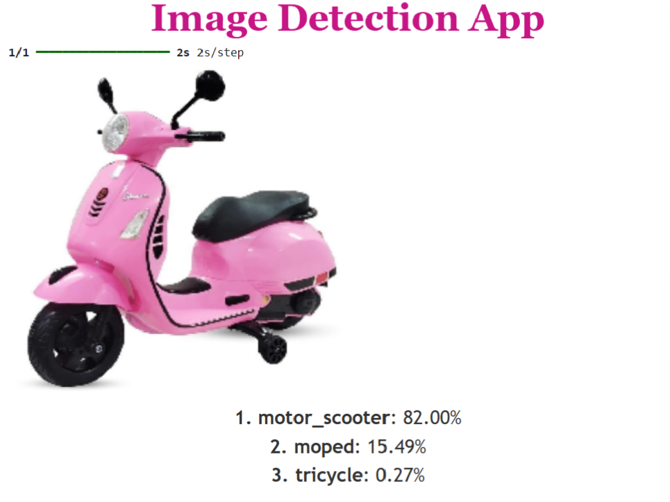

# 🖼️ Image Detection App using MobileNetV2

This is a beginner-friendly image detection app built in Google Colab that uses **MobileNetV2**, a pre-trained deep learning model from TensorFlow’s Keras API, to classify objects in uploaded images.

## 🚀 Features
- Upload an image via Colab interface
- Run object detection using MobileNetV2 trained on ImageNet
- Display top 3 predictions with confidence scores
- Visualize image and results in a clean, styled format

## 📷 Demo



## 🧠 Technologies Used
- Python 🐍
- TensorFlow / Keras
- MobileNetV2
- ImageNet Dataset
- Google Colab
- Matplotlib
- HTML + CSS for styled display

## 📦 How to Run
1. Open in [Google Colab](https://colab.research.google.com/)
2. Upload an image when prompted.
3. Let the model predict and visualize results.

### 🔄 Steps in the Code
```python
# Upload image
from google.colab import files
uploaded = files.upload()

# Load MobileNetV2 and preprocess image
# Predict and decode top 3 labels
# Display uploaded image and predictions
````

## 📝 Output Example

```
1. Labrador Retriever: 87.23%
2. Golden Retriever: 9.14%
3. Kuvasz: 3.07%
```

## 🎯 Purpose

This project is my first step into the exciting world of computer vision and artificial intelligence. Built as a milestone toward my dream of becoming an AI Robotics Engineer.

## 📩 Feedback

I’d love to hear your feedback or suggestions! Feel free to open issues or start a discussion.

## ✨ Author

**Liya** – Computer Science Engineering Student
*“One step, one app at a time.”*

## 🙌 Acknowledgements

Special thanks to [AI with Noor] [(https://youtu.be/gko4WnAgzz4?feature=shared)] for the tutorial inspiration.

